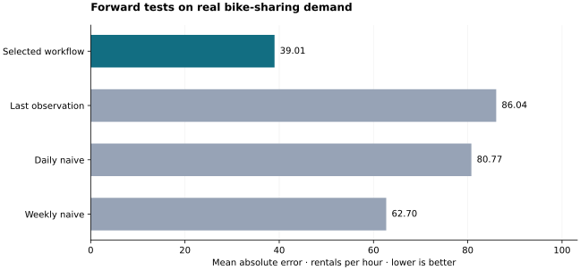
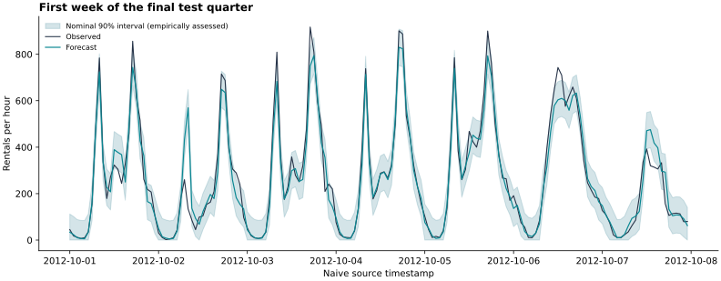

# Bike Demand Forecasting

**Predict the next hour of bike rentals—and measure how uncertain that forecast is.**

A reproducible Python project on real Capital Bikeshare observations from the
public UCI Bike Sharing dataset. It combines clock-time lag features, model
selection on earlier months, three forward test quarters and empirically
assessed prediction intervals.

**32 features · 6,558 held-out hours · 16 passing tests · Resumable model fits**

[Results](reports/RESULTS.md) · [Fixed protocol](docs/PROTOCOL.md) ·
[Data and attribution](docs/DATA.md) · [Resume after interruption](docs/CONTINUATION.md)

## Results at a glance

| Forecast | MAE ↓ | RMSE ↓ |
| --- | ---: | ---: |
| Selected workflow | **39.01** | **65.89** |
| Last observation | 86.04 | 128.83 |
| Daily seasonal naive | 80.77 | 134.40 |
| Weekly seasonal naive | 62.70 | 107.59 |

The selected workflow reduced mean absolute error by **37.8%** relative
to the strongest pooled-test naive baseline. This is a descriptive result on
these historical periods, not a statistical significance or deployment claim.
Models were selected on earlier months, never on these test scores.



The nominal **90%** intervals achieved **88.3%** pooled coverage; they missed the
nominal level overall. Coverage varied from **84.9% to 92.7%** between quarters.
Temporal dependence and distribution shift mean no distribution-free coverage
guarantee is asserted. The full report includes interval width and interval score.

## How the forecast is evaluated

For each hour t, the model can use counts and weather observed through t−1,
plus known calendar information. Current weather and the `casual`/`registered`
components of the target are excluded. Missing clock hours remain missing;
a 24-hour lag really means 24 clock hours, not 24 available rows.

1. Fit three naive baselines, two Ridge candidates and two boosted-tree candidates.
2. Choose the recipe with lowest MAE on an earlier selection month.
3. Refit using eligible history before a separate calibration month.
4. Set a fixed residual-based interval radius using only that calibration month.
5. Evaluate the following quarter, preserving every prediction and split boundary.

The forward tests cover April–June, July–September and October–December 2012.
Boosted trees with 31 leaves were selected for the first two quarters; the
15-leaf candidate was selected for the final quarter.



## Skills demonstrated

| Area | Inspectable implementation |
| --- | --- |
| Data quality and provenance | [Hash-pinned download, schema checks and hourly reindexing](src/bike_forecast/data.py) |
| Leakage prevention | [Past-only features and exclusion of target components](src/bike_forecast/features.py) |
| Model selection and calibration | [Chronological training, selection, refit and testing](src/bike_forecast/experiment.py) |
| Forecast uncertainty | [Finite-sample residual quantile and empirical interval metrics](src/bike_forecast/modeling.py) |
| Reliable execution | [Atomic stages, integrity checks and duplicate-worker lock](src/bike_forecast/checkpoints.py) |
| Reproducible verification | [Causality, cross-process determinism and interruption tests](tests/test_research.py) |

## Run locally

Tested on Python **3.12** with pinned packages. Use a virtual environment:

```bash
python -m venv .venv
# Linux/macOS:
source .venv/bin/activate
# Windows PowerShell instead:
# .venv\Scripts\Activate.ps1
python -m pip install -e .
bike-forecast download
bike-forecast run --output artifacts/official_v2
bike-forecast verify --output artifacts/official_v2
bike-forecast report --output artifacts/official_v2
python -m unittest discover -s tests -v
```

The download is public and needs no API key. A CPU is sufficient. The recorded
run used `OPENBLAS_NUM_THREADS=1` and `OMP_NUM_THREADS=1`; set these environment
variables before running for a comparable thread configuration. GitHub Actions
has a [test workflow](.github/workflows/tests.yml); local and hosted verification
are reported separately.

`report` replaces the generated files in `reports/`. To preserve the committed
report, add `--destination artifacts/my_report`. Model files stay local; load
only joblib artifacts generated by code and data that you trust.

## Pause, resume and audit

```bash
bike-forecast run --output artifacts/official_v2 --max-stages 4
bike-forecast status --output artifacts/official_v2
# Later, resume the same experiment:
bike-forecast run --output artifacts/official_v2
```

Each completed stage is saved atomically and verified before reuse. The completed
experiment has **27 stages**. A full replay reused all 27 with **zero new fits**.
If interrupted during a stage, only that unfinished stage is repeated. Changes
to inputs, source, protocol, package versions or configuration are rejected;
start a new output directory instead of editing a manifest to force reuse.

An early attempt exposed nondeterministic input-column ordering across Python
processes. The fix is covered by a regression test; the earlier four-stage
namespace was preserved and the corrected experiment ran separately. See the
[continuation record](docs/CONTINUATION.md).

| Evidence | Contents |
| --- | --- |
| [Results](reports/RESULTS.md) | Quarter-level and pooled errors, coverage and figures |
| [Metrics](reports/metrics.json) | Candidate scores, selected recipes, dates and row counts |
| [Predictions](reports/predictions.csv) | Every held-out target, forecast, interval and baseline |
| [Manifest](reports/manifest.json) | Input/source hashes, feature schema and package versions |
| [Verification](reports/verification.json) | Replay, independent metric checks and test record |

## Practical limitations

This evaluates sequential **one-hour-ahead forecasts**: observed test-hour
counts can inform later forecasts. It is not a 24-hour forecast issued all at
once. Missing targets are unscored; missingness may bias the evaluated sample.
Naive local timestamps and unspecified measurement latency prevent a fully
verified real-time availability claim. One historical city, two years of data,
seasonal changes and growth limit transfer to modern systems or other cities.
No station-level inventory optimization or causal operational benefit is claimed.

## Project background and license

Created with **OpenAI Codex assistance for Ehsan Cheraghi** in October 2026.
This is a new portfolio research project, separate from earlier client work.
It repurposes the former duplicate-introduction repository, renamed from
`Ehsan-Cheraghi` to `bike-demand-forecasting`.

Code: [MIT](LICENSE). Data: Hadi Fanaee-T (2013),
[UCI Bike Sharing](https://doi.org/10.24432/C5W894), **CC BY 4.0**.
Derived observed totals in the published reports retain that attribution.
See [data provenance and method references](docs/DATA.md).
